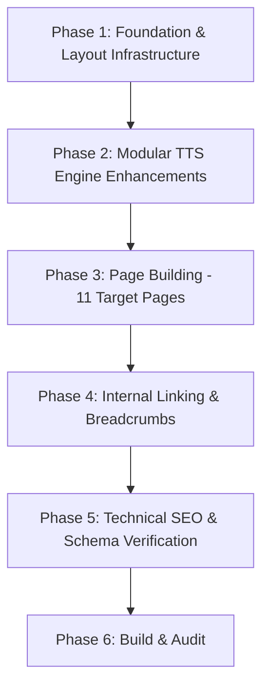

# Implementation Roadmap (`PLAN.md`)

**Target Domain**: `soundtext.github.io`  
**Goal**: Build a high-performance, non-cannibalizing Jekyll web application implementing the compact 11-page architecture outlined in `BLUEPRINT.md`.

---

## 1. Executive Summary

* **Core Feature**: The interactive **Sound of Text Engine** (`_includes/tts.html`), allowing fast client-side text-to-speech audio generation, inline playback, and MP3 download.
* **Architecture**: 6 Core Tool & SEO Pages + 5 Legal/Trust Pages (11 Pages Total).
* **SEO Strategy**: Homepage (`/`) serves as the Master Brand Pillar for "Sound of Text", eliminating internal cannibalization with a `/sound-of-text/` URL.

---

## 2. Phased Execution Roadmap

### **Phase 1: Foundation & Layout Infrastructure**
1. Ensure `_config.yml` has permalink format `/:name/` and url set to `https://soundtext.github.io`.
2. Create layout `silo_pillar.html` for main topic hubs (`/text-to-speech/`, `/text-to-sound/`, `/female-voice/`, `/male-voice/`).
3. Create layout `silo_child.html` for specialized use-case pages (`/sound-of-text-whatsapp/`), automatically inserting breadcrumbs and homepage (`/`) backlinks.

### **Phase 2: Modular Sound of Text Engine (`_includes/tts.html`)**
1. Configure `tts.html` to accept page front-matter variables:
   * `page.tts_preset_text`: Initial prompt text.
   * `page.tts_default_voice`: Default pre-selected voice.
   * `page.tts_gender_filter`: Preset filter (`female` or `male`).
2. Verify audio playback, instant voice search, and direct MP3 download button.

### **Phase 3: Page Generation (11 Pages)**

#### **Core Tool & SEO Pages (6 Pages)**
* `/index.html` — Homepage & Master Sound of Text Pillar.
* `/sound-of-text-whatsapp/` — WhatsApp Voice Generator.
* `/text-to-speech/` — Text to Speech Master Pillar.
* `/text-to-sound/` — Text to Sound Creator.
* `/female-voice/` — Female Voice Synthesis Hub.
* `/male-voice/` — Male Voice Synthesis Hub.

#### **Legal & Trust Pages (5 Pages)**
* `/about/` — Author credentials & technical methodology (`_pages/author.md`).
* `/contact/` — Contact support form (`_pages/contact.md`).
* `/privacy-policy/` — Privacy & zero data retention policy (`_pages/privacypolicy.md`).
* `/terms/` — Terms of Service (`_pages/terms.md`).
* `/disclaimer/` — Disclaimer (`_pages/disclaimer.md`).

### **Phase 4: Internal Linking & Navigation**
1. Standardize header navigation to point to the main tool pillars (`/text-to-speech/`, `/text-to-sound/`, `/female-voice/`, `/male-voice/`).
2. Standardize footer navigation to display all legal and trust pages.
3. Ensure `/sound-of-text-whatsapp/` links directly back to `/`.

### **Phase 5: Technical SEO & Schema**
1. Add `WebApplication` JSON-LD schema dynamically to pages with the TTS tool.
2. Verify canonical URLs target `https://soundtext.github.io`.
3. Check `sitemap.xml` and `robots.txt` configuration.

### **Phase 6: Build Verification & QA**
1. Test Jekyll local build (`bundle exec jekyll build`).
2. Validate TTS audio generation and MP3 downloads.
3. Perform mobile responsiveness & Lighthouse audits.
